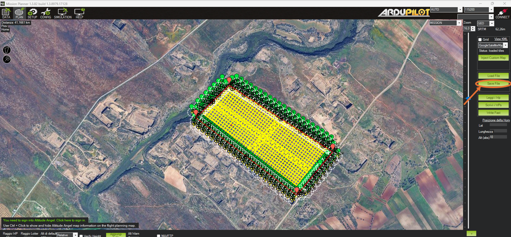
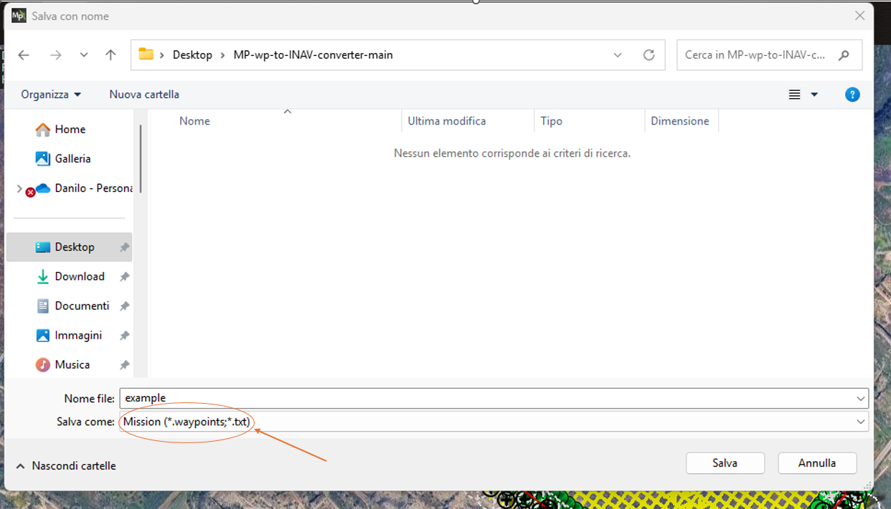
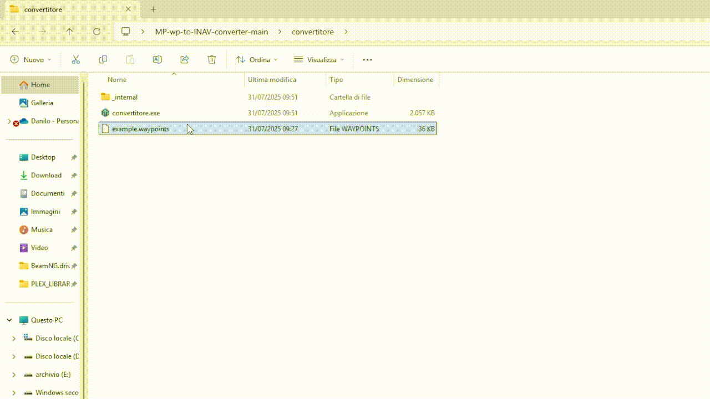
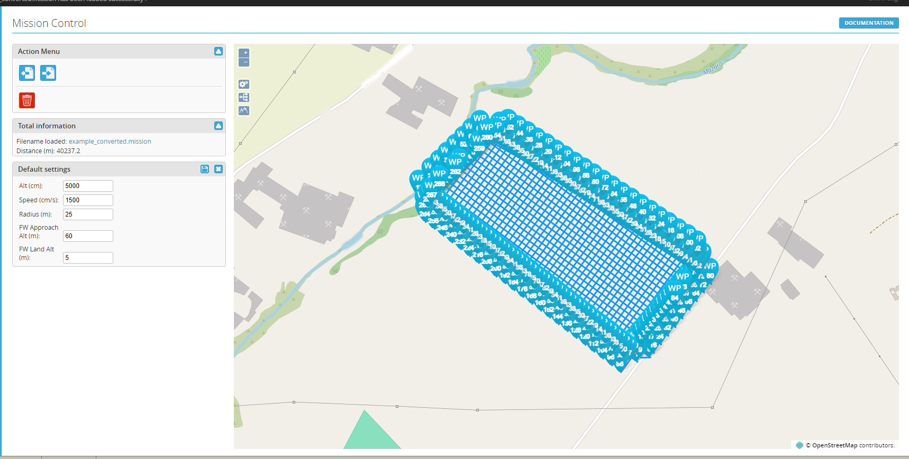

Waypoints to Mission Converter 🗺️➡️🧾

This Python tool converts .waypoints files (from ArduPilot/Mission Planner) into .mission XML files compatible with INAV.

✅ Features
Drag & drop support on Windows

Automatically ignores fake waypoints at coordinates (0, 0)

Saves the converted file as originalfilename_converted.mission

🚀 How to Use
Drag and drop your .waypoints file onto convertitore.py

The converted .mission file will be saved in the same folder with _converted.mission appended to the filename

PROCEDURE:
1-Save Waypoint files in MP

2-Drag and drop the .waypoint file on "convertitore.py" or "convertitore.exe"

3- Open in INAV

